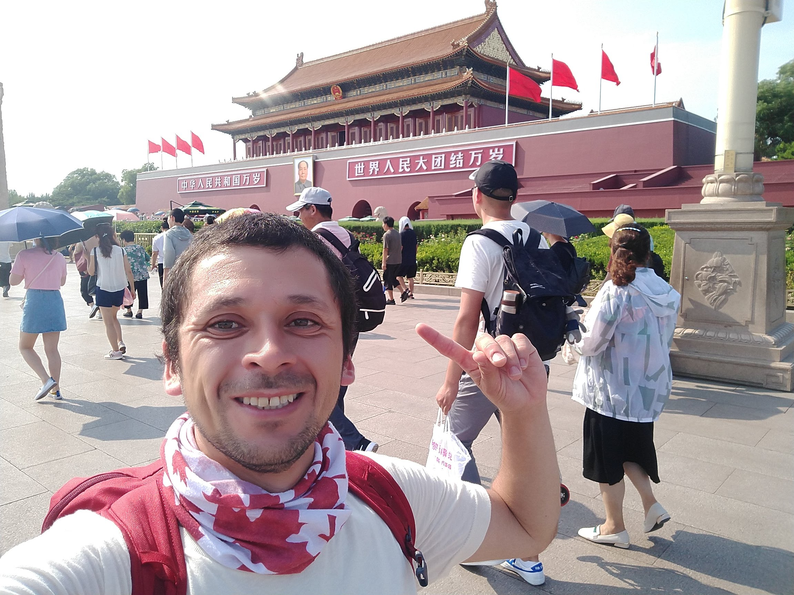
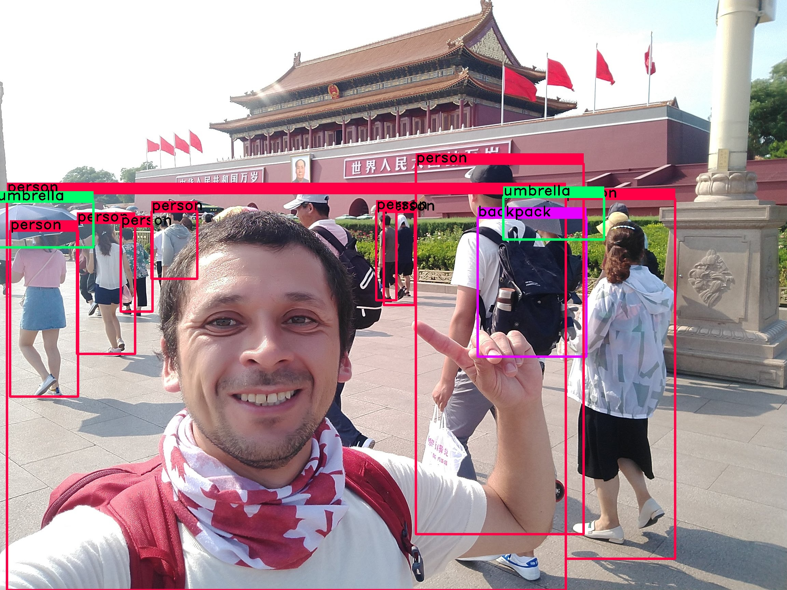

# YOLO-v3

Code to use the YOLO algorithm using a jupyter notebook to identify objects on images.

This algorithm I learned in Neural Networks Specialization course, offered by deeplerarning.ai in coursera site.

##### *keep trying, knowledge is awesome*  :facepunch: